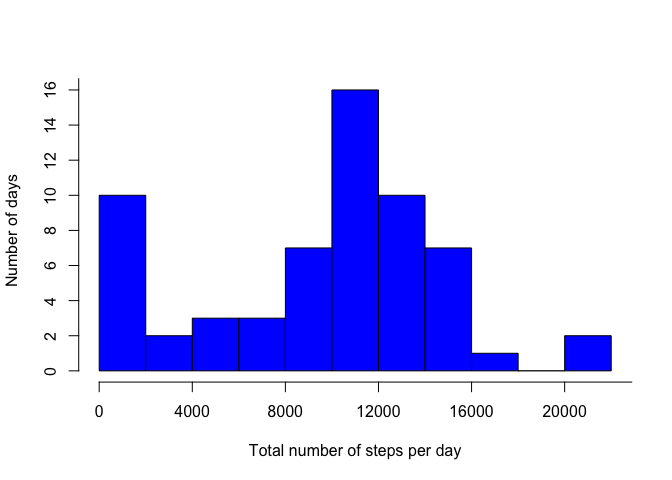
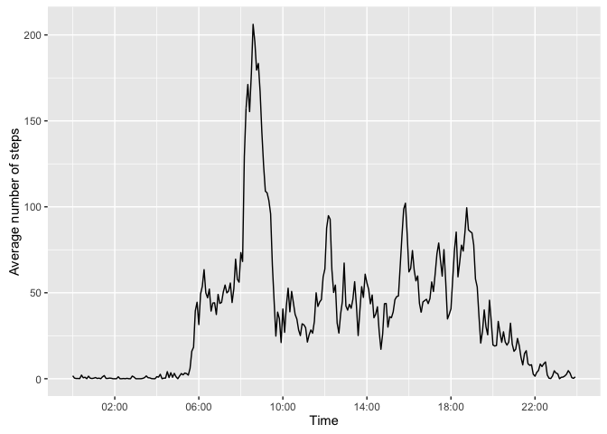
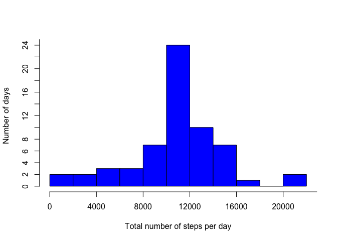
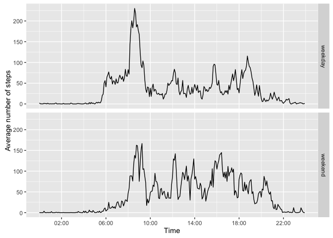

# Reproducible Research: Peer Assessment 1

This report describes the analysis of the data of a personal activity monitoring
device. For a period of two months this device has measured the total number
of steps in 5 minute intervals throughout the day, taken by an anonymous
individual. With our analysis we aim to answer a number of questions.  
  
## Total number of steps taken each day

First, we would like to get some information about the total number of steps taken
each day by the individual. With the following R code we read in the dataset and
constuct a histogram of the total number of steps per day.


```r
# Load some required packages
library(dplyr)
library(ggplot2)
library(stringr)
library(scales)
library(chron)

# Read in the data
data <- read.csv("activity.csv")

# Get the total number of steps per day and make a histogram
stepsPerDay <- with(data, tapply(steps, date, sum, na.rm=TRUE))
hist(stepsPerDay, breaks=10, col="blue", main="", 
     xlab="Total number of steps per day", ylab="Number of days", 
     xaxp=c(0,24000,6), yaxp=c(0,20,10))
```

<!-- -->

The histogram shows a clear peak between 10000 and 12000 steps per day. A second peak at zero steps is also visible. The latter is, however, an artifact of missing data in our dataset, as we will discuss later on.  
To get a better idea of the average number of steps taken each day, we use the following R code to derive the mean and median number of steps.


```r
# Get the mean and median number of steps per day
mean1 <- round(mean(stepsPerDay, na.rm=TRUE),2)
median1 <- median(stepsPerDay, na.rm=TRUE)
```

From the original dataset, we find a mean number of steps per day of 9354.23 and a median of 10395.  
  
## Average daily activity pattern

Next, we would like to know how, on average, the number of steps is distributed
throughout the day. A time series plot of the average number of steps per 5 minute
interval will answer this question.


```r
# Get the average number of steps per interval
intervalMeans <- data %>% group_by(interval) %>% 
                    summarise(mean(steps, na.rm=TRUE))
names(intervalMeans) <- c("Interval","Steps")

# Convert intervals to times
dtTimes <- strptime(str_pad(as.character(intervalMeans$Interval), 4, pad="0"),
                       "%H%M")
intervalMeans$Time <- as.numeric(dtTimes - trunc(dtTimes, "days"))
class(intervalMeans$Time) <- "POSIXct"

# Make a time series plot of the average number of steps per interval
qplot(Time, Steps, data=intervalMeans, geom="line",
      ylab="Average number of steps") + 
    scale_x_datetime(labels=date_format("%H:%M"),
                     breaks=date_breaks("4 hours"))
```

<!-- -->

We see that essentially no steps were taken in the first set of intervals, between midnight and 5 AM. This is not surprising since these intervals correspond to the nighttime, when the individual was sleeping. A peak around 9 AM is also clearly visible. With the following R code


```r
# Get the interval containing the maximum average number of steps
maxInt <- intervalMeans$Time[which.max(intervalMeans[[2]])]
maxInt <- substr(chron::times(maxInt/86400),1,5)
```

we find that, on average, most steps were taken at 08:35.

## Imputing missing values

The original dataset contains a number of intervals with missing values, i.e. where no measurements were made. With the following code


```r
# Get the total number of rows containing NA's
numNA <- sum(!complete.cases(data))
```

we find that there are 2304 intervals with missing values.  
These could introduce a bias in our conclusions, so we would like to replace them by
an estimate of the real values. More specifically, we create a new dataset where each
missing value has been replaced by the (rounded) average of the number of steps in that
interval across all days.


```r
# Fill in the missing values with the mean value of that interval
filledData <- data
for(i in seq(length(data[[1]]))) {
    if (is.na(filledData[i,1])) {
        int <- filledData[i,3]
        filledData[i,1] <- round(intervalMeans[intervalMeans[1]==int,2])
    }
}
```
  
<br>
To evaluate the effect of this procedure, we make an updated version of the histogram of the total number of steps taken each day.


```r
# Get the total number of steps per day and make a histogram for
# the new, filled data set
stepsPerDay2 <- with(filledData, tapply(steps, date, sum))
hist(stepsPerDay2, breaks=10, col="blue", main="", 
     xlab="Total number of steps per day", ylab="Number of days", 
     xaxp=c(0,24000,6), yaxp=c(0,30,15))
```

<!-- -->

The apparent peak at zero steps from the original histogram is now no longer present and has been added to the main peak at 10000 steps. Interestingly, some days with very few steps taken (between 0 and 4000) still remain.  
<br>
We also re-evaluate the average number of steps taken per day:


```r
# Get the mean and median number of steps per day for the filled data
options(scipen=999)
mean2 <- round(mean(stepsPerDay2), 2)
median2 <- median(stepsPerDay2)
```

The mean number of steps per day is now 10765.64 and the median number of steps
per day has become 10762. After imputing the missing values the mean number of steps is much closer to the median number of steps.  

## Weekdays vs. weekends

As a list item in this analysis, we investigate whether the average activity pattern per day differs between weekdays and weekends. The updated dataset, without missing values, is used for this.


```r
# Add a factor variable to the filled data indicating whether
# the day is a weekday or not
wkDays <- c("Monday","Tuesday","Wednesday","Thursday","Friday")
filledData$day.type <- factor(weekdays(as.Date(filledData[,2]))%in%wkDays, 
                              levels=c(TRUE,FALSE), 
                              labels=c("weekday","weekend"))

# Get the average number of steps per interval and per day type
means <- filledData %>% group_by(interval, day.type) %>% 
         summarise(mean(steps))
names(means) <- c("Interval","Day.Type","Steps")

# Convert intervals to times
dtTimes2 <- strptime(str_pad(as.character(means$Interval), 4, pad="0"),
                       "%H%M")
means$Time <- as.numeric(dtTimes2 - trunc(dtTimes2, "days"))
class(means$Time) <- "POSIXct"

# Make a panel plot
qplot(Time,Steps,data=means,facets=Day.Type~.,geom="line",
      ylab="Average number of steps") + 
    scale_x_datetime(labels=date_format("%H:%M"),
                     breaks=date_breaks("4 hours"))
```

<!-- -->

The plots look rather similar, but at weekend days the individual was clearly more active during the day, i.e. between 10 AM and 8 PM. A potential explanation for this is that the individual has a desk job and spends most of his time at work sitting down. On average, the individual also seems to get out of bed about two hours later in the weekend than on week days.  
<br>
Flor Allaert
